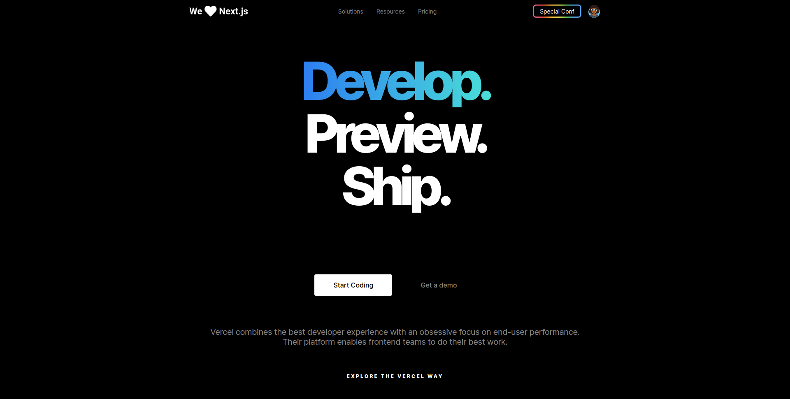
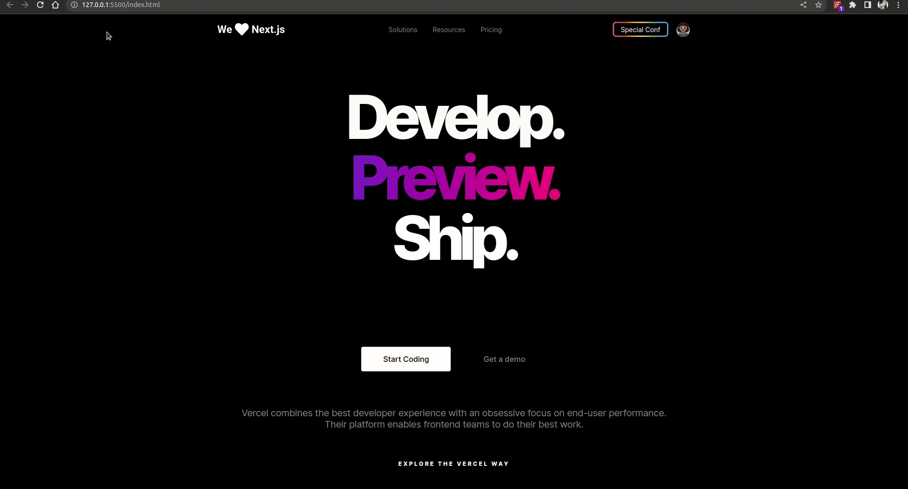

  
<h4 align="center">
  UI Clone da homepage da Vercel 🙂
</h4>

  

  
  
  
  

 

  <a href="#sobre">Sobre</a> •
  <a href="#ui-clone">UI Clone</a> •
  <a href="#instalação">Instalação</a> •
  <a href="#tecnologias">Tecnologias</a> •
  <a href="#autor">Autor</a>  

 

## Sobre

Projeto desenvolvido para praticar conceitos de desenvolvimento web e ter contato com SCSS. A aplicação foi construída seguindo [este tutorial](https://youtu.be/204ewU7NRO0) que pertence a playlist da [RocketSeat](https://rocketseat.com.br/) de clones de interfaces de sites famosos com o intuito de entender como podem ser implementados e não para fins de cópias.

## UI Clone

UI clone da homepage da Vercel feito para fortalecer habilidades em desenvolvimento web e com SASS.
A homepage é bem simples, como podemos ver abaixo:

A cereja do bolo desse projeto foi criar a animação em gradientes com o SASS. A animação é feita no texto principal da página e abaixo deixo uma demonstração da animação:

## Instalação

Para visualizar o resultado não é necessário instalar nenhuma ferramenta adicional, basta ter um navegador instalado. Tendo um browser instalado, basta abrir o arquivo `index.html` com ele e pronto, a página já será exibida.

## Tecnologias

    

## Autor

<h1>Luiz Rioja</h1>
<strong>Backend Developer</strong>
 
 

 
 

